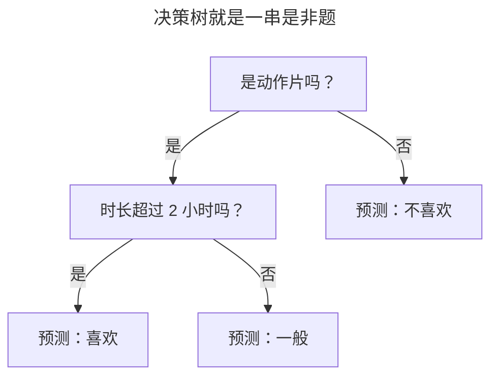

> 作者：轻松学AI
> 日期：2026-09-26
> 风格：通俗科普 + 实操教程
> 状态：待发布

# 从零开始学机器学习 #08：决策树——机器怎么学会"if-else"

前面几篇的算法，或多或少都带点数学味——损失函数、梯度、概率、距离。这一篇的主角不一样，它是所有机器学习算法里最像人类思考方式的一个，简单到你看一眼就懂。

它叫决策树。它做判断的方式，就是问一连串"是非题"。

要不要给一个客户放贷？先问"月收入过万吗"，是就往下问"有没有逾期记录"，没有就"批准"。这一串 if-else 的判断，画出来就是一棵倒着长的树。你写代码时天天在用 if-else，决策树厉害的地方在于——**这些 if-else 不是你写的，是机器自己从数据里学出来的。**

## 一棵树，就是一串问题

先看决策树长什么样。假设我们要判断一个人会不会喜欢某部电影，决策树可能长这样：



从最上面的根节点出发，每个节点问一个问题，根据答案往左或往右走，最后落到某个叶子节点，那就是预测结果。

这个结构的好处太明显了：**它完全可解释。** 前面的逻辑回归、KNN，你很难跟外行说清"它为什么这么判"。但决策树可以——你顺着树走一遍，每一步问了什么、怎么答的，清清楚楚。在需要向监管、客户、医生解释"凭什么这么判"的场景里，这种透明是别的算法给不了的。

问题来了——树上每个节点该问什么问题？先问"是不是动作片"还是先问"时长多久"？这个顺序不是随便定的，它决定了整棵树的好坏。

## 怎么选问题：让数据变"纯"

决策树选问题的标准，一句话：**挑那个最能把数据分干净的问题。**

什么叫"分干净"？假设你手上一堆样本，红蓝两类混在一起，乱糟糟。一个好问题，应该能把它们尽量分开——问完之后，一边尽量都是红的，另一边尽量都是蓝的。


看这张图。分裂前红蓝混杂，最乱。挑一个好问题（比如"x 小于 5 吗"）切一刀，左边几乎全红、右边几乎全蓝，两边都变"纯"了。

衡量"纯不纯"有个指标叫基尼系数：一组样本全是同一类时，基尼是 0（最纯）；两类各占一半时，基尼最大（最乱）。决策树遍历所有可能的问题，算每个问题分裂后能让基尼下降多少，挑下降最多的那个。这个"下降的量"也叫信息增益——本质是一回事：哪一刀切下去，混乱减少得最多，就选哪一刀。

```python
def gini(y):
    """基尼不纯度：全同一类为 0，越混乱越大"""
    counts = np.bincount(y)
    probs = counts / len(y)
    return 1.0 - np.sum(probs ** 2)
```

就这么几行。决策树建树时，每个节点都调用它，反复比较不同分裂的基尼下降，贪心地选当前最好的那一刀，然后对切出来的两边递归地重复这个过程，直到数据足够纯或者达到停止条件。

说白了就是：决策树是一层层地问"哪个问题最能把数据分干净"，问到底就成了一棵树。

## 长得太深，就开始"背答案"

决策树有个危险的天性：如果不加限制，它会一直分裂下去，直到每个叶子节点都只剩一个样本——训练集准确率 100%。

听着耳熟吗？这就是第三篇讲的过拟合，决策树是最容易犯这个毛病的算法之一。


看这三张真实跑出来的决策边界。最大深度 =1，树只问一个问题，边界就一条直线，太粗糙（欠拟合）。深度 =8，树问得又细又深，边界变得极其破碎，甚至为个别孤立点单独圈地——它在死记硬背训练数据里的噪声。深度 =3 最舒服，抓住了大势又没走火入魔。

决策树的边界都是横平竖直的阶梯状，这是它的特征——因为它每次只能沿一个特征切一刀，切出来的都是矩形区域。

怎么防止它长疯？办法叫剪枝。最简单的一种是预剪枝——提前设个最大深度，或者规定"节点样本少于几个就不再分了"，强行让树在长疯之前停手。上面深度 =3 的效果就是限制深度的结果。剪枝是决策树的必修课，不剪的树几乎必然过拟合。

## sklearn 一行，和它更强的后代

工业界用法：

```python
from sklearn.tree import DecisionTreeClassifier
model = DecisionTreeClassifier(max_depth=3)   # 限制深度防过拟合
model.fit(X, y)
model.predict(X_new)
```

注意那个 `max_depth`——它就是我们说的预剪枝。用决策树几乎总要设它，这是你懂原理后不会踩的坑。

单棵决策树有个短板：它很"不稳定"，训练数据稍微变一点，长出来的树可能完全不同。但这个短板恰恰催生了机器学习里最强大的一类方法——把很多棵树组合起来。一群各有缺陷的树凑在一起投票，稳定性和准确率会大幅提升。


这正是下一篇的主角：随机森林。它把几十上百棵决策树种成一片林子，用"三个臭皮匠顶个诸葛亮"的思路，成了表格数据上至今难以撼动的王者。决策树是它的基石——你现在懂了这块基石，下一篇就能看懂那片森林。

从一串 if-else 到一棵会自己长的树，决策树告诉我们：机器学习不总是深奥的数学，有时候它就是把人类"分情况讨论"的朴素智慧，自动化了而已。

---

本文的决策树代码（基尼系数 + 递归分裂 + 预剪枝）和不同深度的决策边界配图都在配套仓库：[ml-from-scratch](https://github.com/Joneyao/ml-from-scratch)。

参考阅读：

- [周志华《机器学习》第 4 章 决策树](https://book.douban.com/subject/26708119/)
- [李航《统计学习方法》第 5 章 决策树](https://book.douban.com/subject/33437381/)
- [scikit-learn 官方文档：Decision Trees](https://scikit-learn.org/stable/modules/tree.html)
- [决策树与信息增益通俗理解](https://www.cnblogs.com/xiaoxia722/p/14328598.html)
