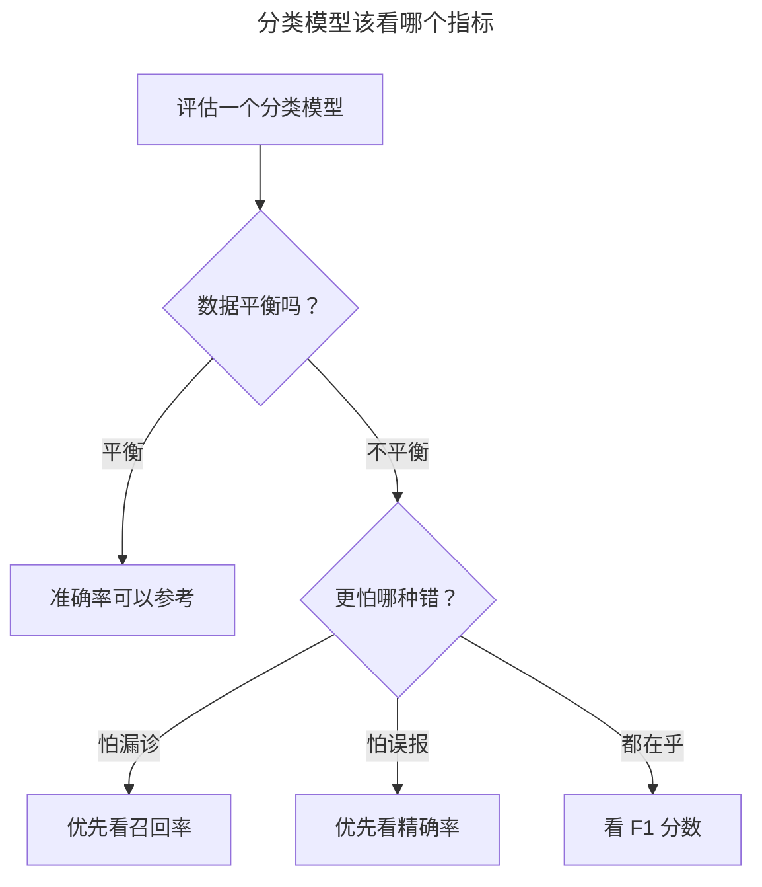

> 作者：轻松学AI
> 日期：2026-09-26
> 风格：通俗科普 + 实操教程
> 状态：待发布

# 从零开始学机器学习 #12：模型评估——准确率高就是好模型吗？

有一个 99% 准确率的癌症筛查模型，听起来很厉害。但它可能是个彻头彻尾的废物——一个病人都没查出来。

这不是绕口令。这一篇要打破一个新手最容易上的当：**用准确率一个数字判断模型好坏。** 准确率是最直观的指标，也是最会骗人的指标。前面十一篇我们一直在造模型，这一篇停下来，认真学怎么审判一个模型——这件事，比再多学一个算法都重要。

## 准确率陷阱：99% 的骗局

先把那个"废物模型"讲清楚。

假设一个地区做癌症筛查，1000 个人里，真正患病的只有 10 个。现在有个偷懒的模型，它根本不看数据，对所有人一律判"健康"。


算算它的准确率：990 个健康人，它全判对了；10 个病人，它全判错了。准确率 = 990 / 1000 = 99%。

99% 啊，多漂亮的数字。可这个模型有任何价值吗？没有。它把 10 个真正需要救治的病人全放过了，一个都没揪出来。它唯一做的事就是"闭着眼睛说所有人都健康"。

问题出在哪？**当一个类别远比另一个类别少见时（这叫类别不平衡），准确率就会失真。** 病人只占 1%，模型只要无脑猜"多数派"（健康），准确率天然就有 99%。这种场景在现实里极其常见——欺诈检测、疾病诊断、故障预警，要找的都是茫茫正常里的极少数异常。

所以，光看准确率会让你对一个废物模型拍手叫好。我们需要更诚实的指标。

## 混淆矩阵：把对错拆开看

要看清模型到底错在哪，得把"对"和"错"拆开。工具叫混淆矩阵。

它把预测结果分成四格：真的病人被判病（对）、真的病人被判健康（漏诊）、健康人被判病（误诊）、健康人被判健康（对）。四个格子，把模型的每一种对、每一种错，都摊开在你面前。


左边就是用配套仓库手写的评估代码，对随机森林在真实乳腺癌数据上的预测画出的混淆矩阵。四个格子清清楚楚：对角线是判对的，非对角线是判错的。相比一个笼统的准确率数字，它让你一眼看出模型到底是"漏诊多"还是"误诊多"——这俩错误的代价可完全不一样。

从这四个格子，能算出两个远比准确率有用的指标——精确率和召回率。

## 精确率与召回率：抓得准，还是抓得全

这两个指标是模型评估的核心，也是最容易搞混的一对。用癌症筛查的例子一说就懂。


**精确率**回答：模型报"患病"的人里，有多少是真患病的？它衡量"抓得准不准"。精确率低，意味着误报多——一堆健康人被吓得半死去做进一步检查。

**召回率**回答：所有真患病的人里，有多少被模型揪出来了？它衡量"抓得全不全"。召回率低，意味着漏诊多——真病人被放回家，这在医疗场景是致命的。

回头看开头那个"全判健康"的废物模型：它的召回率是 0（10 个病人一个没抓到），一下就现原形了。准确率遮住的真相，召回率一眼看穿。

关键在于，**精确率和召回率常常此消彼长。** 你想抓得更全（提高召回率），就得把判定门槛放低，宁可错杀也不放过，结果误报变多、精确率下降。反过来想抓得更准，就得提高门槛，结果漏掉一些、召回率下降。

到底偏向哪个，取决于场景：癌症筛查宁可误报不可漏诊，优先保召回率；垃圾邮件过滤宁可漏一封垃圾也别把重要邮件误判，优先保精确率。想两者兼顾，还有个综合指标叫 F1 分数，是它俩的调和平均。

说白了就是：**没有放之四海皆准的"好模型"，只有"适合这个场景的模型"。** 而判断适不适合，靠的就是根据场景选对评估指标。

## 怎么用：选对指标，比调高准确率更重要

回到实践。评估一个分类模型，正确的姿势不是盯着准确率，而是：

先看数据平不平衡。平衡的话，准确率还能用；不平衡（像癌症筛查），准确率基本没参考价值，直接看精确率、召回率、F1。然后想清楚这个场景更怕哪种错——怕漏（看召回率）还是怕错杀（看精确率），据此选定要优化的指标。



sklearn 把这些指标都备好了：

```python
from sklearn.metrics import confusion_matrix, precision_score, recall_score, f1_score
confusion_matrix(y_true, y_pred)     # 四格全貌
precision_score(y_true, y_pred)      # 抓得准不准
recall_score(y_true, y_pred)         # 抓得全不全
f1_score(y_true, y_pred)             # 两者的平衡
```

还有个常用的综合指标叫 AUC（就是上面那张图右边 ROC 曲线下的面积），衡量模型在各种判定门槛下的整体表现，越接近 1 越好。它不受单一门槛影响，是比较模型的常用标尺。

这一篇没教新算法，但教了一件更底层的事：**怎么诚实地评价一个模型。** 这个能力，会跟着你走完整个机器学习生涯。因为在真实项目里，"这个模型到底行不行"这个问题，永远比"再训一个新模型"更常被问到，也更难回答对。

集成学习这一章到这里就完整了：随机森林、GBDT 两大主力，加上这一篇的评估方法论。下一篇我们进入一片新天地——无监督学习。前面所有算法都靠"标准答案"（标签）来学，可如果数据压根没有答案呢？机器还能从中学到东西吗？K-Means 聚类会给出第一个回答。

---

本文的评估指标代码（混淆矩阵 / 精确率 / 召回率 / F1 / ROC / AUC）和真实数据配图都在配套仓库：[ml-from-scratch](https://github.com/Joneyao/ml-from-scratch)。

参考阅读：

- [周志华《机器学习》第 2 章 性能度量](https://book.douban.com/subject/26708119/)
- [scikit-learn 官方文档：Model Evaluation](https://scikit-learn.org/stable/modules/model_evaluation.html)
- [精确率、召回率、F1、ROC 通俗理解](https://www.cnblogs.com/xiaoxia722/p/14328598.html)
- [为什么准确率会骗人：类别不平衡问题](https://cloud.tencent.com/developer/article/1748011)
