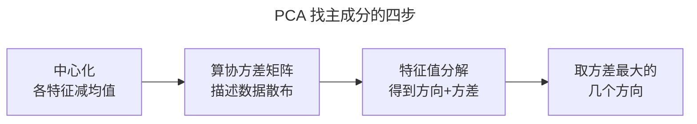

> 作者：轻松学AI
> 日期：2026-09-26
> 风格：通俗科普 + 实操教程
> 状态：待发布

# 从零开始学机器学习 #14：PCA——把高维数据"压扁"还不丢信息

上一篇 KNN 那里我们埋过一个词：维度灾难。当数据的特征多到几百上千维，麻烦就来了——算距离失灵、模型变慢、人也根本没法把数据画出来看。

这一篇的 PCA，就是对付高维数据的一把利器。它能把几百维的数据压到两三维，还能保住其中大部分信息。压完之后你甚至能把原本没法可视化的高维数据画在一张二维图上，一眼看出结构。

听起来像魔法——扔掉几百个维度还不丢信息？这一篇讲清楚它凭什么做到，核心就一个朴素的想法：**沿着数据"铺得最开"的方向去看。**

## 降维不是随便删几列

先破除一个误解。把高维数据降到低维，最笨的办法是直接删列——64 个特征我只留 2 个，扔掉 62 个。这么干信息损失巨大，因为你扔掉的那些列里可能藏着关键信息。

PCA 不这么干。它不是从原有的维度里挑几个留下，而是**造出几个全新的方向**，让数据在这几个新方向上尽可能保留原来的差异。

关键就在"差异"这个词。数据在哪个方向上差异大（专业点叫方差大），哪个方向就携带了更多信息。


看这团斜着铺开的点。它在红色箭头这个方向上铺得最开——点与点在这个方向上拉得最长，差异最大。如果只能用一个方向来概括这团数据，选它准没错，因为它保留了最多的"谁和谁不一样"的信息。这个方向，就叫第一主成分。

沿着这个思路，PCA 找出第一主成分（数据铺得最开的方向），再找和它垂直的、铺得第二开的方向作为第二主成分，以此类推。想降到几维，就取前几个主成分。**降维 = 把数据投影到这几个最能体现差异的新方向上。** 扔掉的是那些"大家都差不多、没什么区分度"的方向，损失自然小。

## 它怎么找到那些方向

PCA 找主成分的数学工具，叫协方差矩阵的特征值分解。名字唬人，但每一步都对应着清晰的直觉。

第一步，中心化：把数据的每个特征都减去它的均值，让整团数据以原点为中心。这是为了让"方差"算得准。

第二步，算协方差矩阵：它描述了数据在各个维度上怎么散布、维度之间怎么关联。

第三步，对协方差矩阵做特征值分解：这一步会吐出一组方向（特征向量）和对应的数值（特征值）。奇妙的地方在于——**每个特征向量就是一个候选的主成分方向，而它对应的特征值，恰好等于数据沿这个方向的方差。**

所以"找方差最大的方向"这件事，被数学转化成了"找最大特征值对应的特征向量"。特征值从大到小排序，取前几个对应的方向，就是前几个主成分。

```python
def fit(self, X):
    X_centered = X - X.mean(axis=0)       # 中心化
    cov = np.cov(X_centered, rowvar=False)  # 协方差矩阵
    eigvals, eigvecs = np.linalg.eigh(cov)  # 特征值分解
    order = np.argsort(eigvals)[::-1]       # 特征值降序
    self.components_ = eigvecs[:, order[:self.n_components]].T  # 取前几个方向
```

这就是 PCA 的全部核心。你不用会推导特征值分解，只要记住这条逻辑链：



前面的地基（方差的概念）在这里又派上了用场。

## 把 64 维手写数字压到一张图上

光说不够震撼，来看真实效果。

我们拿一个经典数据集：手写数字图片，每张是 8×8 的像素，拉直了就是 64 维。64 维的数据人根本没法直观感受。用配套仓库手写的 PCA 把它压到 2 维，画出来：


每个点是一张手写数字图片，颜色代表它实际是哪个数字（0 到 9）。神奇的是——同一个数字的点，在这张二维图上自动聚成了一团！0 扎堆在一处，6 在另一处，4 又在别处。

要知道，PCA 在降维时**根本不知道每个点是什么数字**（它是无监督的，没用标签）。它只是纯粹地找"方差最大的两个方向"做投影，结果同类数字就自然聚拢了。这说明那 64 维里的关键结构，被 PCA 用 2 维就抓住了大半。从 64 维到 2 维，扔掉 62 维，结构却还在——这就是降维不丢关键信息的直观证据。

那到底保留了多少信息？可以量化：


这张图是累计保留的信息比例。横轴是保留的主成分个数，纵轴是留住的信息占比。你看，只用 2 维虽然能可视化，但信息保留还不到 30%；而只要留大约 21 个主成分，就能保住 90% 的信息——用三分之一的维度，留住九成信息。这就是降维的实用价值：大幅减少维度，代价却很小。

## sklearn 三行，和它的真实用途

工业界用法：

```python
from sklearn.decomposition import PCA
pca = PCA(n_components=2)      # 降到 2 维
X_2d = pca.fit_transform(X)
pca.explained_variance_ratio_ # 每个主成分保留了多少信息
```

那个 `explained_variance_ratio_`，就是我们上面那张累计信息图的数据来源。


PCA 在真实工作里用途极广。数据可视化——把高维数据压到 2、3 维画出来看结构，就像上面那张数字图。给模型加速——先用 PCA 降维再训练，特征少了，模型又快又不容易过拟合，这也正好接上了上一篇 KNN 说的"高维数据先降维"。还有图像压缩、去噪等等。它是数据预处理阶段最常用的工具之一。

PCA 教给我们一个深刻的道理：**信息不均匀地分布在各个维度上。** 有些方向承载了大量差异，有些方向几乎是冗余。找到并保留那些重要的方向，扔掉冗余的，就能用更少的维度描述同一份数据。这个"抓主要矛盾"的思想，远超出降维本身。

下一篇是无监督学习的最后一站，聊一个特别实用的问题：怎么在一大堆正常数据里，揪出那几个"不对劲"的异常？信用卡盗刷、设备故障、网络入侵——异常检测每天都在保护着我们。

---

本文的 PCA 代码（协方差 + 特征值分解）和真实降维配图都在配套仓库：[ml-from-scratch](https://github.com/Joneyao/ml-from-scratch)。

参考阅读：

- [周志华《机器学习》第 10 章 降维与度量学习](https://book.douban.com/subject/26708119/)
- [scikit-learn 官方文档：PCA](https://scikit-learn.org/stable/modules/decomposition.html#pca)
- [李航《统计学习方法》第 16 章 主成分分析](https://book.douban.com/subject/33437381/)
- [PCA 主成分分析通俗图解](https://www.cnblogs.com/xiaoxia722/p/14328598.html)
