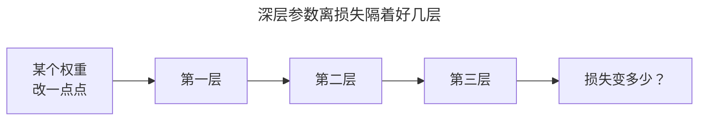

> 作者：轻松学AI
> 日期：2026-09-26
> 风格：通俗科普 + 实操教程
> 状态：待发布

# 从零开始学机器学习 #17：反向传播——神经网络"学"的核心魔法

反向传播，被很多人当成神经网络里最玄的东西。一提到它，脑子里就浮现出密密麻麻的偏导数公式，望而生畏。

但我要告诉你一个真相：**反向传播没有任何魔法，它就是高中学过的链式求导，只是算得特别有章法。**

上一篇我们看到，单个感知机学不会异或，出路是"多层"。可多层网络有成千上万个参数，怎么知道每个参数该往哪调？第二篇的梯度下降告诉我们"沿梯度反方向走"，但那时只有两个参数，梯度好算。现在几万个参数，梯度怎么算？反向传播就是那个高效算出所有参数梯度的方法。它是让多层神经网络能训练起来的核心，也是当年把神经网络从寒冬里救活的那把火。这一篇，我们把这层"魔法"的窗户纸捅破。

## 问题：几万个参数，梯度怎么算

先说清楚反向传播到底解决什么。

训练神经网络，本质还是第二篇那套：定义损失，然后梯度下降——算出损失对每个参数的梯度，让每个参数朝减小损失的方向挪一点。

难点在"算梯度"。一个多层网络，输入经过第一层、第二层、第三层……层层变换，最后算出损失。现在你想知道：第一层某个权重改变一点点，最终的损失会变化多少？这就是损失对那个权重的梯度。

问题是，那个权重离损失隔着好几层，中间的影响一环扣一环。几万个参数，每个都要算这么一笔账，硬算根本算不过来。



反向传播的聪明之处，是把这笔账拆成了可以机械化、可以复用的小步骤。而拆解的依据，就是链式法则。

## 链式法则：一环扣一环的影响

链式法则是什么？用大白话说：**如果 A 影响 B，B 影响 C，那么 A 对 C 的总影响，等于"A 对 B 的影响"乘以"B 对 C 的影响"。**


放到神经网络里：你改一点输入端的参数 x，它影响中间量 a，a 影响输出 y，y 影响最终损失 L。那么 x 对 L 的总影响，就是这一路上每一环影响的连乘。

这个道理太符合直觉了。就像多米诺骨牌，第一张推倒的力度，怎么传到最后一张？把每一张对下一张的传递效果乘起来就行。链式法则给了我们一个机械的办法：不用一步到位算"x 对 L"这个复杂的整体，只要把路径上每一小段的简单导数算出来，连乘即可。

关键在于——每一小段的导数都特别好算。加法、乘法、激活函数，这些基本运算的导数都是现成的、简单的。难的从来不是单步求导，而是怎么把它们高效地组合起来。反向传播给出的答案是：**从损失出发，沿着计算过程反着走一遍。**

## 前向算结果，反向传梯度

神经网络的计算可以画成一张图——数据从输入流进来，经过一个个运算节点（乘、加、激活），最后汇成损失。这张图叫计算图。


反向传播分两趟走这张图：

**前向传播（黑色箭头）：** 数据从左往右流，一步步算出每个中间结果，最后得到损失。这一趟就是正常的预测过程。

**反向传播（红色箭头）：** 从损失出发，沿着图反着往回走。每经过一个节点，就用链式法则把梯度"分配"给它的输入——这个节点对损失的责任，按各输入的贡献分摊下去。一路反向流回输入端，每个参数的梯度就都算出来了。

妙就妙在，前向时每个节点已经知道了自己的局部导数，反向时直接拿来乘上"从上游传来的梯度"，再传给下游。梯度像水一样从损失端往回流，流过每个参数时就在它身上留下"你该调多少"的信息。**一次前向 + 一次反向，全部参数的梯度就都有了**——这就是它高效的秘密，不用为每个参数单独算一遍。

## 30 行代码，看清整个魔法

光说不过瘾。反向传播的核心，用配套仓库里一个极简的自动微分引擎就能看清——它模仿了 Karpathy 著名的 micrograd。核心就是给每个数值包一层壳，记录它是怎么算出来的，以及怎么把梯度往回传：

```python
class Value:
    def __init__(self, data, _children=()):
        self.data = data          # 前向的数值
        self.grad = 0.0           # 梯度，反向传播后填上
        self._prev = set(_children)  # 记住是谁算出了我
        self._backward = lambda: None  # 怎么把梯度传给上游

    def __mul__(self, other):     # 乘法：out = self * other
        out = Value(self.data * other.data, (self, other))
        def _backward():
            # 链式法则：out 的梯度按局部导数分给两个输入
            self.grad += other.data * out.grad
            other.grad += self.data * out.grad
        out._backward = _backward
        return out
```

看那个 `_backward`：乘法的局部导数——`out` 对 `self` 的导数就是 `other`，对 `other` 的导数就是 `self`（这是乘法求导的基本规则）。反向传播时，把上游传来的 `out.grad` 乘上这个局部导数，就是该分给每个输入的梯度。加法、激活函数各有自己的 `_backward`，道理一样。

最后一步，从损失出发，按计算的逆序依次调用每个节点的 `_backward`，梯度就自动流遍全图：

```python
def backward(self):
    topo = topological_sort(self)   # 按计算顺序排好
    self.grad = 1.0                 # 损失对自己的梯度是 1
    for node in reversed(topo):     # 逆序：从损失往回
        node._backward()            # 每个节点把梯度传给上游
```


这就是反向传播的全部。真实的深度学习框架（PyTorch、TensorFlow）做的事，本质就是这个 `Value` 类的工业级、支持张量和 GPU 的版本。你手写这几十行看懂了，那些框架里的 `loss.backward()` 对你就不再是黑盒——它背后就是这套"沿计算图反向传梯度"的机械过程。

说白了就是：**你以为的黑魔法，其实是一堆简单导数按链式法则的自动连乘。** 神经网络能训练起来，靠的就是这个又朴素又高效的机制。

到这里，深度学习最难的那道坎，你已经跨过来了。感知机是神经元，反向传播是训练神经元网络的方法——两块最硬的基石都到位了。下一篇，我们把它们拼起来：用纯 NumPy 手写一个多层神经网络，让它真正去识别手写数字。你会亲眼看到，前面所有的地基——损失、梯度下降、感知机、反向传播——如何合力完成一件曾经被认为很"智能"的事。

---

本文的反向传播代码（micrograd 风格自动微分引擎）都在配套仓库，可以自己跑一遍看梯度怎么流：[ml-from-scratch](https://github.com/Joneyao/ml-from-scratch)。

参考阅读：

- [周志华《机器学习》第 5 章 误差逆传播算法](https://book.douban.com/subject/26708119/)
- [Karpathy: micrograd（反向传播极简实现）](https://github.com/karpathy/micrograd)
- [反向传播与链式法则通俗图解](https://www.cnblogs.com/shine-lee/p/11809979.html)
- [一文看懂神经网络反向传播](https://juejin.cn/post/7096315783583809550)
