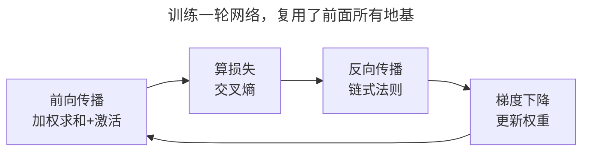

> 作者：轻松学AI
> 日期：2026-09-26
> 风格：通俗科普 + 实操教程
> 状态：待发布

# 从零开始学机器学习 #18：手写 MLP，识别真实的手写数字

到了兑现承诺的时候。

前面十七篇，我们一块砖一块砖地打地基：损失、梯度下降、感知机、反向传播。这一篇，我们把这些砖拼成一栋楼——用纯 NumPy 手写一个多层神经网络，让它识别真实的手写数字。不调用任何深度学习框架，每一行都是我们自己写的。

结果先剧透：这个从零手写的小网络，识别手写数字的准确率能到 95%。更重要的是，跑通它的那一刻你会发现——曾经觉得高不可攀的"神经网络识别图像"，原来你已经完全理解了每一个零件。

## 把感知机堆成一栋楼

先说清楚"多层感知机"（MLP）到底是什么。

第十六篇我们看到，单个感知机只能画一条直线，连异或都学不会。出路是"多层"。把很多感知机并排组成一层，再把多层串起来，中间夹上非线性激活，就是多层感知机。


看这张结构图。我们要识别的手写数字是 8×8 的小图片，拉直了就是 64 个像素值，这就是输入层的 64 个节点。中间是隐藏层，有 64 个神经元，每个都是一个感知机，负责从像素里提取特征。最后输出层有 10 个节点，对应数字 0 到 9，哪个节点的值最大，就预测是哪个数字。

层与层之间全连接——每个输入都连到隐藏层的每个神经元，每个隐藏神经元又连到每个输出。这些连接上的权重，就是网络要学的参数，加起来几千个。

为什么"多层"就比单层强？关键在隐藏层加的那个非线性激活（ReLU）。


看这张对比：单个感知机面对异或，一条直线怎么画都分错（左）。而多层网络能把这条直线"掰弯"成曲线边界，轻松分开（右）。**多层 + 非线性，让网络能拟合任意复杂的形状**——这正是它能识别手写数字这种复杂模式的根本原因。

## 前面的地基，全用上了

这个网络怎么训练？答案是——把前面所有篇章的东西拼起来，没有一样是新的。

**前向传播**：64 个像素输入，乘以第一层权重、加偏置、过 ReLU 激活，得到隐藏层的值；再乘第二层权重、过 softmax，得到 10 个数字的概率。这就是第五篇讲的"加权求和 + 激活"，只是做了两层。

**算损失**：用交叉熵衡量预测概率和真实标签的差距。这是第五篇逻辑回归用过的损失。

**反向传播**：用上一篇的链式法则，把损失对几千个权重的梯度全部算出来。

**梯度下降**：每个权重朝梯度反方向挪一点。这是第二篇的核心。

看，训练一个神经网络需要的所有零件，我们前面全都单独讲透了。



现在只是把它们组装起来：

```python
def fit(self, X, y):
    for _ in range(self.n_epochs):
        z1 = X @ self.W1 + self.b1      # 隐藏层：加权求和
        a1 = np.maximum(0, z1)          # ReLU 激活
        z2 = a1 @ self.W2 + self.b2     # 输出层：加权求和
        probs = softmax(z2)             # 转成概率
        # 反向传播：softmax+交叉熵的梯度特别简洁
        dz2 = (probs - Y) / n            # 输出层误差
        dW2 = a1.T @ dz2                 # 链式法则往回传
        da1 = dz2 @ self.W2.T
        dz1 = da1 * (z1 > 0)             # ReLU 的梯度
        dW1 = X.T @ dz1
        self.W2 -= self.lr * dW2         # 梯度下降更新
        self.W1 -= self.lr * dW1
```

这段代码浓缩了整个系列。前向那几行是"加权求和+激活"的堆叠，反向那几行是链式法则的手动展开，最后两行是梯度下降。**没有黑魔法，全是你已经懂的东西。** 这就是"从零手写"的意义——它让神经网络对你彻底透明。

## 95% 的准确率，亲眼见证

代码写好，跑起来。用配套仓库里这个纯 NumPy 的 MLP，在真实手写数字数据集上训练，结果是这样：


左边是训练过程：随着一轮轮训练，损失（红线）稳稳下降，准确率（绿线）一路爬升，最终测试集准确率到了 95%。你能清楚看到网络在"学习"——损失下降的每一步，都是反向传播算出梯度、梯度下降调整权重的结果。

右边更让人有成就感：这是网络对真实手写数字的预测。一张张 8×8 的模糊小图，网络绝大多数都认对了（绿色），偶尔认错一两个（红色）。要知道，这些手写数字歪歪扭扭、粗细不一，连人有时都要辨认一下，而我们几百行纯 NumPy 代码写出来的网络，认对了 95%。

停下来体会一下这件事的分量。识别手写数字，曾经是 AI 领域一个标志性的难题。而现在，你不仅能让它跑起来，还能说清楚里面每一个数字是怎么算出来的——从像素输入，到加权求和，到激活，到 softmax 概率，到反向传播调参。**这个曾经的"智能"，在你眼里已经没有任何神秘可言了。**

## sklearn/PyTorch 一行，和你的收获

工业界当然不会这么手写。用 sklearn 或 PyTorch，几行就够：

```python
from sklearn.neural_network import MLPClassifier
model = MLPClassifier(hidden_layer_sizes=(64,))
model.fit(X, y)
model.predict(X_new)
```

真实的深度学习框架（PyTorch）还支持 GPU 加速、自动求导、各种优化器，能训练几亿参数的大网络。但它们的内核，和你手写的这个 MLP 一模一样：前向传播、反向传播、梯度下降。规模天差地别，原理分毫不差。


这正是"从零手写"的最大价值：**当你用 PyTorch 训练一个大模型时，`loss.backward()` 背后发生了什么，你心里一清二楚。** 调库的人很多，知道库里在干嘛的人才走得远——遇到训练不收敛、损失爆炸、梯度消失这些真实问题时，是这份底层理解让你能对症下药，而不是抓瞎试参数。

到这里，我们从"机器学习在学什么"一路走到了"手写神经网络识别图像"，十八篇，一条完整的路。经典机器学习的核心算法、通向神经网络的桥，都走通了。

下一篇是整个系列的收官。我们不学新算法，而是回头看看这一路：经典机器学习和深度学习到底是什么关系？学完这些，你站在了什么位置，接下来该往哪走？我会给你一张清晰的地图，和一些真心的建议。

---

本文的手写 MLP 代码（纯 NumPy 前向 + 反向 + softmax）和真实训练配图都在配套仓库：[ml-from-scratch](https://github.com/Joneyao/ml-from-scratch)。

参考阅读：

- [周志华《机器学习》第 5 章 神经网络](https://book.douban.com/subject/26708119/)
- [Karpathy: makemore / micrograd（从零手写神经网络）](https://github.com/karpathy/micrograd)
- [scikit-learn 官方文档：Neural network models](https://scikit-learn.org/stable/modules/neural_networks_supervised.html)
- [纯 NumPy 手写神经网络识别 MNIST](https://juejin.cn/post/7096315783583809550)
