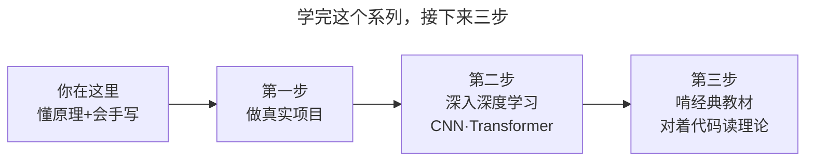

> 作者：轻松学AI
> 日期：2026-09-26
> 风格：通俗科普 + 实操教程
> 状态：待发布

# 从零开始学机器学习 #19：从这里去哪？经典 ML 与深度学习的分水岭

这是这个系列的最后一篇。

十八篇走下来，我们从"机器学习到底在学什么"出发，亲手实现了十几个经典算法，最后用纯 NumPy 手写了一个能识别手写数字的神经网络。这一篇不学新东西，我们做三件事：给整条路画一张地图，说清经典机器学习和深度学习到底什么关系，以及告诉你接下来该往哪走。

先说一个可能颠覆你认知的事实：**在今天这个深度学习和大模型霸屏的时代，经典机器学习不但没有过时，反而在很多场景下依然是更好的选择。** 这不是怀旧，是事实。

## 你已经走完的这条路

先回头看看，这一路你到底学了什么。

五个部分，环环相扣。**地基**打下了整个机器学习的公共语言——学习就是最小化损失，梯度下降负责找最低点，过拟合是头号敌人。**监督学习**六个算法，教会机器在有标准答案时怎么预测——从线性回归到 SVM，六种不同的思路。**集成学习**告诉你，组合一堆弱模型能胜过单个强模型。**无监督学习**证明了没有答案也能学，靠的是数据自身的结构。最后的**神经网络**，从单个感知机到反向传播再到手写 MLP，搭起了通往深度学习的桥。

这张图值得你存下来。它不只是这个系列的目录，更是整个经典机器学习的知识骨架。以后你看任何一个新算法、新论文，几乎都能在这张图上找到它的位置——它要么在改进某个环节（更好的优化、更强的集成），要么在解决某个老问题（过拟合、高维、无标签）。

有了这张地图，你就不再是"学了一堆孤立的算法"，而是掌握了一个有结构的知识体系。这正是从零手写一遍的最大收获——你不是背下了算法，你是理解了它们为什么长这样、彼此怎么关联。

## 经典 ML 和深度学习，不是取代关系

现在回答那个最多人困惑的问题：都 2026 年了，大模型这么火，学这些经典算法还有用吗？

太有用了。因为经典机器学习和深度学习，从来不是"新的取代旧的"，而是各有各的地盘。

看这张对比。深度学习在图像、语音、文本这类"非结构化数据"上称王——这些数据维度极高、模式极复杂，需要网络自动学特征，也吃得下海量数据和算力。但在**结构化的表格数据**上（也就是一行行、一列列那种，占了商业世界数据的绝大多数），情况完全反过来。

一个反直觉但业界公认的事实：**在表格数据上，GBDT 这类经典模型至今常常打败深度神经网络。** 不是深度学习不够强，是它在这个场景没有优势——表格数据量通常没那么大，特征也不需要网络去自动提取，而 GBDT 又快、又准、还能告诉你哪个特征重要。Kaggle 上大量表格数据竞赛，冠军方案的核心至今还是 GBDT。

还有更现实的考量。经典模型跑在普通电脑上就行，深度学习常常要 GPU；经典模型（尤其树模型）可解释性好，能告诉你"为什么这么判"，深度学习是黑盒，这在金融、医疗等需要向监管解释的场景是硬伤；经典模型数据量小也能work，深度学习没有海量数据就发挥不出来。

所以正确的心态不是"经典的过时了，只学深度学习就行"，而是：**手里多几把工具，遇到问题挑最合适的那把。** 表格数据、中小规模、要解释——先想经典模型；图像语音文本、海量数据、追求极限性能——上深度学习。真正的高手，是知道什么时候用什么。

## 接下来往哪走

学完这个系列，你站在了一个很好的位置：你不只会调库，还理解了底层原理。接下来这几步，会让你走得更远。

**第一步，把手弄脏。** 找一个真实的数据集（Kaggle 上有海量免费数据），用这个系列学的算法完整做一个项目：数据清洗、特征处理、训练模型、评估调优。纸上得来终觉浅——真正让知识变成能力的，是你独立跑通一个从数据到结果的完整流程。配套仓库里的代码就是很好的起点，改改数据集跑跑看。

**第二步，深入深度学习。** 你已经手写过 MLP，理解了前向、反向、梯度下降，深度学习的大门已经向你敞开。接下来可以学 CNN（专门处理图像）、RNN 和 Transformer（处理序列和文本，也是大模型的核心）。有了这个系列的地基，你学它们会比别人快得多——因为你知道它们不过是"感知机 + 反向传播"在特定结构上的延伸。

**第三步，选一本经典深挖。** 这个系列是"通俗入门 + 动手实现"，想更严谨可以配一本经典教材：周志华的《机器学习》（西瓜书）覆盖全面，李航的《统计学习方法》推导严谨。对着代码读理论，理论会活起来。

坦白说，学机器学习最大的障碍从来不是数学，而是"觉得它很神秘、高不可攀"。而你已经亲手把这层神秘感捅破了——你写过梯度下降，推过反向传播，训过神经网络。你知道所谓的"AI 智能"，拆开看就是一堆能被你完全理解的数学运算。这份"祛魅"后的清醒和自信，比任何具体算法都珍贵。

这个系列到这里就结束了。十九篇，从一条直线到一个神经网络，从"机器怎么学"到"你也会让机器学"。感谢你走完这一整程。

机器学习的世界很大，你现在手握地图、脚下有路。接下来的探索，交给你了。后面我会再开一个专门讲深度学习的系列，我们下一段旅程见。

---

本系列全部 19 篇的配套代码（纯 NumPy 从零手写经典 ML 算法 + sklearn 对照）都在这个开源仓库，欢迎 star 和自己动手跑：[ml-from-scratch](https://github.com/Joneyao/ml-from-scratch)。

参考阅读：

- [周志华《机器学习》（西瓜书）](https://book.douban.com/subject/26708119/)
- [李航《统计学习方法》](https://book.douban.com/subject/33437381/)
- [为什么 GBDT 在表格数据上仍打败深度学习](https://arxiv.org/abs/2207.08815)
- [Kaggle：真实数据集与竞赛](https://www.kaggle.com/)
- [scikit-learn 官方文档](https://scikit-learn.org/stable/)
